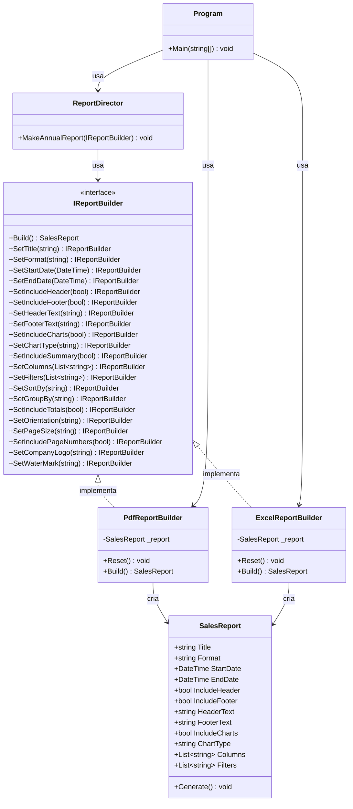

## 🥁 CarnaCode 2026 - Desafio 02 - Builder

Oi, eu sou o Ronaldo e este é o espaço onde compartilho minha jornada de aprendizado durante o desafio **CarnaCode 2026**, realizado pelo [balta.io](https://balta.io). 👻

Aqui você vai encontrar projetos, exercícios e códigos que estou desenvolvendo durante o desafio. O objetivo é colocar a mão na massa, testar ideias e registrar minha evolução no mundo da tecnologia.

### Sobre este desafio
No desafio **Builder** eu tive que resolver um problema real implementando o **Design Pattern** em questão.
Neste processo eu aprendi:
* ✅ Boas Práticas de Software
* ✅ Código Limpo
* ✅ SOLID
* ✅ Design Patterns (Padrões de Projeto)

## Problema
Sistema precisa gerar diferentes tipos de relatórios (PDF, Excel, HTML) com múltiplas configurações opcionais (cabeçalho, rodapé, gráficos, tabelas, filtros).
O código atual usa construtores enormes ou muitos setters, tornando difícil criar relatórios.

### Problemas identificados
1. **Construtor telescópico** — Construtores com muitos parâmetros, difíceis de ler e manter.
2. **Muitos setters** — A ordem não importa e configurações obrigatórias podem ser esquecidas.
3. **Duplicação de código** — Relatórios com configurações parecidas exigem copiar/colar muito código.

## Solução — Padrão Builder

O **Builder** é um padrão criacional que separa a construção de um objeto complexo da sua representação, permitindo criar diferentes representações com o mesmo processo de construção.

### Como o padrão foi aplicado

| Componente | Classe | Responsabilidade |
|---|---|---|
| **Product** | `SalesReport` | O objeto complexo que está sendo construído |
| **Builder Interface** | `IReportBuilder` | Define todos os passos de construção |
| **Concrete Builders** | `PdfReportBuilder`, `ExcelReportBuilder` | Implementam os passos para cada formato |
| **Director** | `ReportDirector` | Orquestra a construção de relatórios pré-definidos |

### Como cada problema foi resolvido

**Problema 1 → Fluent Builder**
Cada configuração é definida por um método encadeável, eliminando o construtor telescópico:
```csharp
var report = new PdfReportBuilder()
    .SetTitle("Vendas Mensais")
    .SetIncludeCharts(true)
    .SetChartType("Bar")
    .Build();
```

**Problema 2 → Interface fluente com validação**
Os Builders encapsulam a lógica de criação e podem validar campos obrigatórios no método `Build()`.

**Problema 3 → Director**
O `ReportDirector` reutiliza configurações comuns em métodos como `MakeAnnualReport()`, evitando duplicação:
```csharp
var director = new ReportDirector();
var builder = new PdfReportBuilder();
director.MakeAnnualReport(builder);
var report = builder.Build();
```

## Estrutura do Projeto

```
src/
├── Challenge.cs              # Ponto de entrada (Program.Main)
├── DesignPatternChallenge.csproj  # Configuração do projeto .NET 8
├── IReportBuilder.cs         # Interface Builder
├── PdfReportBuilder.cs       # Builder concreto para PDF
├── ExcelReportBuilder.cs     # Builder concreto para Excel
├── ReportDirector.cs         # Director para relatórios padrões
└── SalesReport.cs            # Produto (relatório de vendas)
```

### Diagrama de Classes



## Como Executar

```bash
# A partir da raiz do projeto
dotnet run --project src/DesignPatternChallenge.csproj

# Ou a partir do diretório src/
cd src && dotnet run
```

## Sobre o CarnaCode 2026
O desafio **CarnaCode 2026** consiste em implementar todos os 23 padrões de projeto (Design Patterns) em cenários reais. Durante os 23 desafios desta jornada, os participantes são submetidos ao aprendizado e prática na idetinficação de códigos não escaláveis e na solução de problemas utilizando padrões de mercado.

### eBook - Fundamentos dos Design Patterns
Minha principal fonte de conhecimento durante o desafio foi o eBook gratuito [Fundamentos dos Design Patterns](https://lp.balta.io/ebook-fundamentos-design-patterns).

### Veja meu progresso no desafio
[Incluir link para o repositório central]
